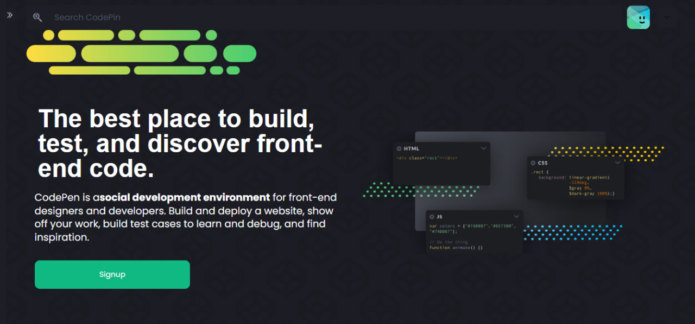
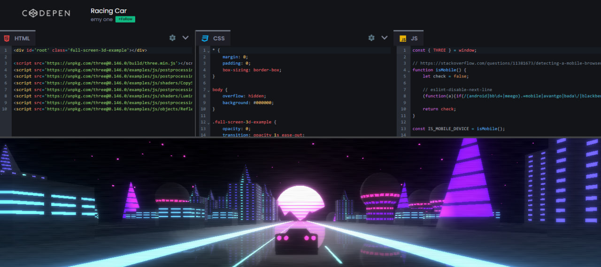
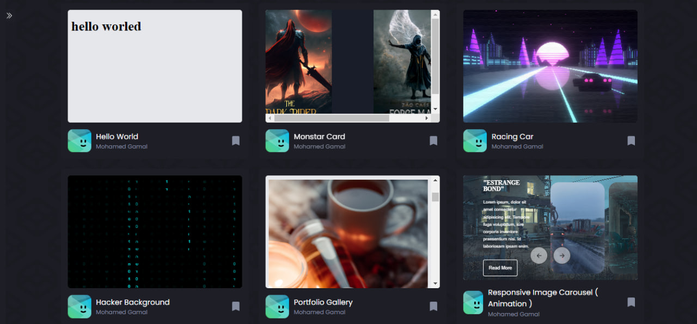

<h1 style="color:rgb(16 185 129 )">CodePen Clone </h1>

## Full Stack CodePen Clone React Application   

CodePen is an online community for testing and showcasing user-created HTML, CSS and JavaScript code snippets.
 It functions as an online code editor and open-source learning environment, where developers can create code snippets, called "pens," and test them.

<h1 style="color:rgb(16 185 129 ) "> Front-end Technologies and liberaries </h1>

    - HTML 
    - CSS 
    - JavaScript 
    - React.js 
    - Routing 
    - Redux 
    - Google Authentication 
    - Tailwind CSS
    - FireBase 
    - Framer motion
    - React Icons
    - MUI
    - Code Mirror 
    - UUID 
    - React Split Pane 
    - React Loader Spinner 

<h1 style="color:rgb(16 185 129 ) "> User Stories & Features</h1>

    💹 As a visitor, you can see a visually appealing and intuitive landing page with a clear navigation menu so that you can easily understand the purpose of the website and find my way around.

    💹 As a registered user, you can be able to log in and log out of my account so that you can securely access and manage your pens and projects.

    💹 As a registered user, you can create a new pen by providing a title, description, and choosing the appropriate HTML, CSS, and JavaScript settings so that you can start working on your code projects.

    💹 As a user, you have a real-time code editor with separate tabs for HTML, CSS, and JavaScript, and the ability to see live previews of your code changes so that you can easily experiment and iterate on my projects.

    💹 As a user, you can be able to search for pens based on keywords, tags so that you can discover interesting and relevant code projects.

    💹 As a mobile user, the website is responsive and provide a seamless experience on different devices so that I can access and use CodePen on the go.

  <h3 style="color:rgb(16 185 129 ) ">Website Screenshot in Laptop screen </h3>
      
     
    

<!-- <h1 style="color:rgb(16 185 129 ) "> Check out Website Preview Here </h1>

> [food-delivery.com](https://food-delivery-ashy.vercel.app/)
 -->

<h1 style="color:rgb(16 185 129 ) "> Check out Website Video Here </h1>

> [Youtube video](https://youtu.be/31zRZG7TaO0)

